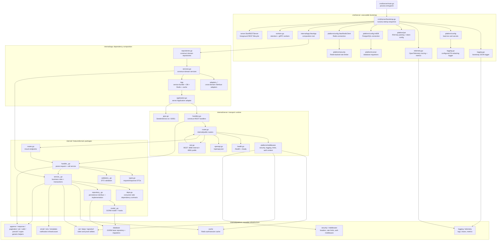
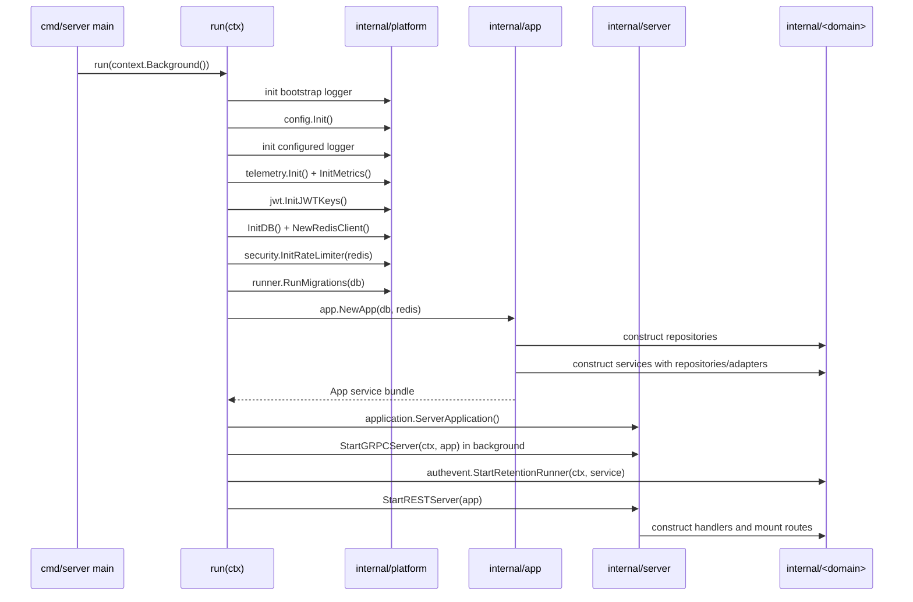
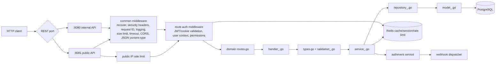
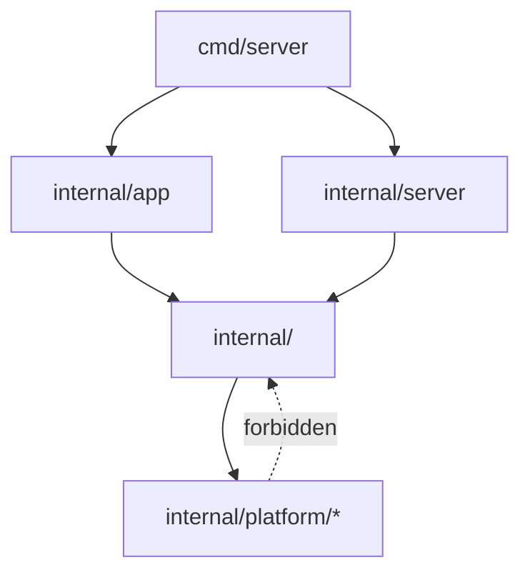

# Architecture Flowchart

This document shows how the application connects from the executable entrypoint
down into domain packages and platform infrastructure.

Use this as a navigation map before editing cross-package behavior. The diagram
shows ownership boundaries, not every function call.

## End-to-End Flow



## Startup Flow



## Request Flow



## Domain Package Shape

Most feature packages use the role-first structure below. A package should only
include files for roles it actually owns.

```text
internal/<domain>/
  model_<name>.go          database model, table names, hooks
  repository_<name>.go     persistence contract and implementation
  service_<name>.go        business behavior and transactions
  handler_<name>.go        HTTP handler logic
  validation_<name>.go     DTO validation
  types.go                 API request/response DTOs
  deps.go                  consumer-side upstream contracts
  foundation.go            local platform aliases/wrappers
  routes.go                route mounting
```

Current top-level domain packages:

```text
authevent
authn
branding
client
iam
idp
invite
mfa
notifier
oauth
secpolicy
setup
tenant
user
webhook
```

## Platform Boundary

`internal/platform` is for reusable infrastructure that does not import domain
packages. Domain packages may import platform helpers; platform must not import
domains.



Common platform responsibilities:

- `config`, `database`, `runner`: environment, storage, migrations.
- `cache`, `security`, `middleware`: Redis-backed cache, rate limits, HTTP middleware.
- `jwt`, `dpop`, `signedurl`, `crypto`: token, proof, and cryptographic helpers.
- `logging`, `telemetry`: structured logs, traces, metrics.
- `email`, `sms`, `templates`: notification infrastructure.
- `apperror`, `response`, `pagination`, `ptr`, `valid`, `jsonutil`: generic helpers.
